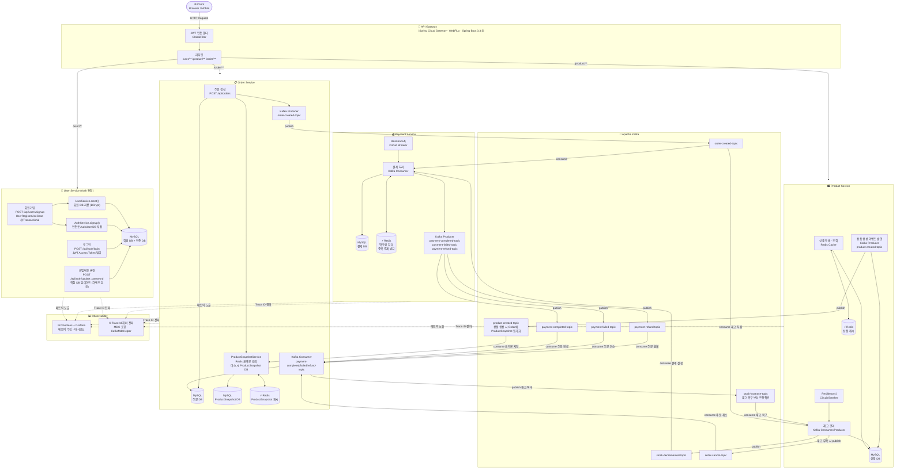

# 💳 CorePay — MSA 기반 결제 시스템

> **Java 21 · Spring Boot 4 · Kafka · Redis · MySQL · Docker**
> 실무 수준의 마이크로서비스 아키텍처를 직접 설계하고 구현한 백엔드 포트폴리오 프로젝트입니다.

---

## 📌 프로젝트 개요

CorePay는 MSA(Microservices Architecture) 패턴을 적용한 결제 시스템입니다.
사용자 인증, 상품 관리, 주문, 결제 등 실제 커머스 도메인을 독립된 서비스로 분리하여 구성하였으며,
서비스 간 통신은 **Apache Kafka** 이벤트 스트리밍을 중심으로 사용합니다.

> 💡 **[v2 아키텍처 변경]**
> - **Auth Service → User Service 통합**: 회원 관리와 JWT 인증을 단일 서비스에서 처리. `UserRegisterUseCase`가 `@Transactional` 하나로 User + Auth DB를 동시 저장하고 Kafka 이벤트 발행을 제거.
> - **Order Service OpenFeign 제거**: Product Service 동기 호출 대신 **Kafka 이벤트로 동기화된 ProductSnapshot(Redis 캐시 + 로칼 DB)**을 조회하는 방식으로 대체.

| 항목 | 내용 |
|---|---|
| 언어 | Java 21 (Virtual Threads 지원) |
| 프레임워크 | Spring Boot 4.0.3 / Spring Cloud 2025.1.1 |
| 메시지 브로커 | Apache Kafka |
| 캐시 | Redis |
| DB | MySQL (Flyway 마이그레이션 관리) |
| 모니터링 | Spring Actuator + Micrometer + Prometheus / Grafana |
| 공통 라이브러리 | corepay-common (내부 Maven 배포) |
| 회복 탄력성 | Resilience4j (Circuit Breaker) |

---

## 🏗️ 시스템 아키텍처



---

## 📦 서비스 목록

### 👤 User Service (Auth 통합)
> **역할**: 회원 가입/정보 관리, JWT 발급·검증, Spring Security 기반 인증 처리

- **[Auth 통합]** `UserRegisterUseCase.register()`가 `@Transactional` 하나로 `UserService.creat()` + `AuthService.signup()`을 순차 호출 → 회원 DB와 인증 DB를 동시 저장, **Kafka 발행 없음**
- Spring Security + JWT (`jjwt 0.12.x`): `POST /api/auth/login` 로그인 시 Access Token 직접 발급
- 비밀번호 변경(`POST /api/auth/update_password`)은 Auth DB를 직접 업데이트, Kafka 미사용
- Flyway로 DB 스키마 버전 관리

> 💡 **통합 이유**: 이전에는 Auth Service가 별도 서비스로 존재하여 Kafka `user-created-topic`을 통해 인증 데이터를 동기화해야 했습니다. 이벤트 유실이나 순서 역전 시 로그인 불가 상태가 되는 리스크가 있었습니다. User Service에 통합함으로써 회원가입과 인증 데이터가 **동일 트랜잭션**으로 액튰되어 데이터 정합성이 보장되고 운영 복잡도가 줄었습니다.

🔗 **[corepay_user 저장소 바로가기](https://github.com/jihoon-68/corepay_user)**

---

### 🛍️ Product Service
> **역할**: 상품 등록/조회/재고 관리, Redis 캐싱으로 조회 성능 최적화

- Redis Cache로 상품 목록/상세 캐싱
- 상품 등록 시 `product-created-topic` Kafka 이벤트 발행 → Order Service가 ProductSnapshot 동기화
- Kafka Consumer/Producer: 재고 차감·복원 이벤트 처리
- Resilience4j Circuit Breaker 적용
- Prometheus 메트릭 노출 (재고 변동 모니터링)

🔗 **[corepay_product 저장소 바로가기](https://github.com/jihoon-68/corepay_product)**

---

### 📋 Order Service
> **역할**: 주문 생성 및 상태 관리, ProductSnapshot 기반 상품 정보 조회

- **[OpenFeign 제거]** Product Service 직접 스닉 호출 없음 → `ProductSnapshotService`로 **Redis 캐시 조회 → DB Fallback** 방식으로 상품 정보 얻음
- Kafka Consumer: `product-created-topic` 수신 → ProductSnapshot 로칼 저장/업데이트
- Kafka Producer: 주문 생성 이벤트 → Payment Service로 전달
- Kafka Consumer: 결제 완료/실패/환불 이벤트 수신 후 주문 상태 업데이트
- Resilience4j로 외부 서비스 장애 시 Fallback 처리

🔗 **[corepay_order 저장소 바로가기](https://github.com/jihoon-68/corepay_order)**

---

### 💰 Payment Service
> **역할**: 결제 처리 및 트랜잭션 관리, 결제 이력 저장

- Kafka Consumer: 주문 이벤트 수신 후 결제 로직 실행
- Kafka Producer: 결제 성공/실패/환불 이벤트 발행 → Order Service로 전달
- Redis로 멱등성(idempotency) 처리 (중복 결제 방지)
- Resilience4j Circuit Breaker로 외부 PG 장애 격리
- Prometheus + Grafana로 결제 성공률 및 처리 시간 모니터링

🔗 **[corepay_payment 저장소 바로가기](https://github.com/jihoon-68/corepay_payment)**

---

### 🚪 API Gateway
> **역할**: 단일 진입점(Single Entry Point), JWT 인증 필터, 서비스 라우팅

- Spring Cloud Gateway (Reactive / WebFlux 기반)
- 요청 수신 → JWT 토큰 검증 → 각 마이크로서비스로 라우팅
- Spring Boot 3.3.5 (Gateway 전용 안정화 버전 사용)
- `/auth/**` 라우팅 제거 → 인증 엔드포인트가 `/user/**` 경로로 통합됨

🔗 **[corepay_api_geteway 저장소 바로가기](https://github.com/jihoon-68/corepay_api_geteway)**

---

## 🔁 주요 흐름 1: 회원가입 → 로그인

```
[회원가입]
1. 클라이언트 → API Gateway → User Service  POST /api/users/signup
2. UserRegisterUseCase.register() 실행 [@Transactional 단일 트랜잭션]
   2-1. UserService.creat()   → 회원 정보 MySQL 저장 (BCrypt 해싱)
   2-2. AuthService.signup()  → 인증용 AuthUser MySQL 저장
   (두 저장이 한 트랜잭션 내 실행 — Kafka 발행 없음)
3. User Service → 클라이언트  201 Created 응답

[로그인]
4. 클라이언트 → API Gateway → User Service  POST /api/auth/login
5. AuthService.login()  → AuthUser 조회 → BCrypt 비밀번호 검증 → JWT 발급
6. User Service → 클라이언트  {"accessToken": "Bearer ..."
```

> 💡 **설계 포인트**: 통합 전 Auth Service는 `user-created-topic` Kafka 이벤트를 소비하여 인증 데이터를 동기화했습니다. 이벤트 유실 또는 순서 역전 시 회원가입 직후 로그인이 되지 않는 위험이 있었습니다. 통합 후는 동일 트랜잭션으로 두 DB가 함께 커밋/롤백되어 **데이터 정합성이 트랜잭션 수준으로 보장**됩니다.

---

## 🔁 주요 흐름 2: 주문 → 결제 이벤트 플로우

```
1. 클라이언트 → API Gateway (JWT 검증) → Order Service  POST /api/orders
2. ProductSnapshotService.getProductInfos()
   2-1. Redis에서 product:snapshot:{id} 일괄 조회
   2-2. 캐시 미스 시 ProductSnapshot DB IN 쿼리로 Fallback
   (OpenFeign 호출 없음, 동기 서비스 간 의존 없음)
3. Order 저장 + Kafka order-created-topic 발행 (ApplicationEventPublisher)
4. Payment Service → Kafka 소비 → 결제 처리
5. Product Service → Kafka 소비 → 재고 차감 → stock-decremented-topic 발행
6. Payment Service → payment-completed/failed-topic 발행
7. Order Service → Kafka 소비 → 주문 상태 업데이트
```

> 💡 **설계 포인트**: OpenFeign을 제거하여 Order Service는 Product Service의 장애 여부와 무관하게 상품 정보를 조회합니다. Product Service가 상품을 등록할 때 `product-created-topic`을 발행하면 Order Service가 ProductSnapshot을 로지쪬에 동기화하여 이후 주문 시 Redis 캐시로 빠르게 조회합니다.

---

## 🛠️ 기술적 의사결정 포인트

| 기술 | 도입 이유 |
|---|---|
| Kafka (비동기 통신) | 서비스 간 강결합 방지, 장애 격리, 재처리 용이 |
| **Auth + User 통합** | **Kafka 동기화 제거 → 회원가입+인증을 단일 @Transactional로 보장, 운영 복잡도 감소** |
| **OpenFeign 제거** | **Product Service 직접 스닉 호출 제거 → ProductSnapshot 조회로 의존성 차단** |
| ProductSnapshot (Redis + DB) | 상품 정보를 Order Service 내 로칼에 커싱하여 빨른 주문 생성 지원 |
| Redis Cache | 상품 조회 응답 속도 개선, ProductSnapshot 캐시 캐시 레이어 |
| Resilience4j | 외부 서비스 장애 시 Cascade Failure 방지 |
| Flyway | DB 스키마 변경 이력 추적 및 환경 간 일관성 확보 |
| Virtual Threads (Java 21) | I/O 바운드 처리 성능 향상, 스레드 비용 절감 |
| corepay-common | 중복 코드 제거, 서비스 간 공통 로직 통일 |
| Prometheus + Grafana | 실시간 메트릭 수집 및 대시보드 시각화 |
