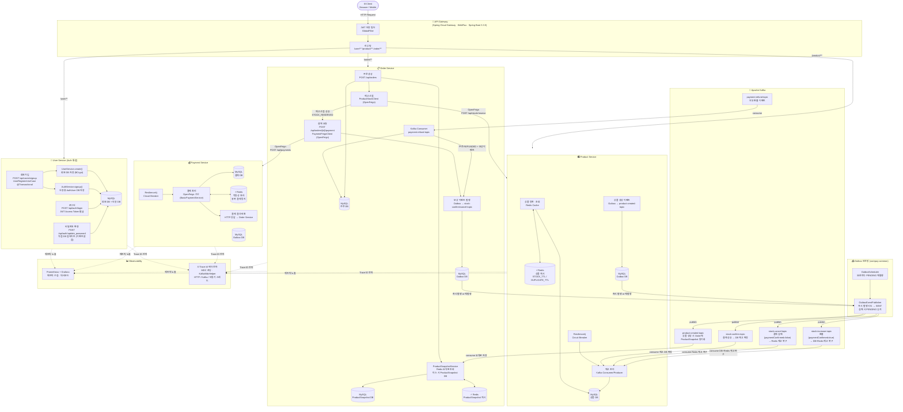

# 💳 CorePay — MSA 기반 결제 시스템

> **Java 21 · Spring Boot 4 · Kafka · Redis · MySQL · Docker**
> 실무 수준의 마이크로서비스 아키텍처를 직접 설계하고 구현한 백엔드 포트폴리오 프로젝트입니다.

---

## 📌 프로젝트 개요

CorePay는 MSA(Microservices Architecture) 패턴을 적용한 결제 시스템입니다.
사용자 인증, 상품 관리, 주문, 결제 등 실제 커머스 도메인을 독립된 서비스로 분리하여 구성하였으며,
서비스 간 통신은 **Apache Kafka** 이벤트 스트리밍과 **OpenFeign** 동기 호출을 목적에 맞게 혼용합니다.

> 💡 **[v2 아키텍처 변경]**
> - **Auth Service → User Service 통합**: 회원 관리와 JWT 인증을 단일 서비스에서 처리. `UserRegisterUseCase`가 `@Transactional` 하나로 User + Auth DB를 동시 저장하고 Kafka 이벤트 발행을 제거.
> - **상품 정보 조회 OpenFeign 제거**: Order Service가 Product Service를 직접 호출하던 방식 대신, **Kafka 이벤트로 동기화된 ProductSnapshot(Redis 캐시 + 로컬 DB)**을 조회하는 방식으로 대체. 재고 선점(`ProductStockClient`)과 결제 요청(`PaymentFeignClient`)은 실시간 처리가 필요하므로 OpenFeign 동기 호출 유지.

> 💡 **[v3 아키텍처 변경]**
> - **Outbox 패턴 도입**: Kafka 발행과 DB 저장을 동일 트랜잭션으로 묶어 이벤트 유실 원천 차단. 즉시 발행 성공 시 `SENT` 처리, 실패 시 `OutboxScheduler`가 30초마다 `PENDING` 이벤트를 재발행하는 이중 안전망 구조.
> - **MDC 분산 트레이싱**: `X-Trace-Id` 헤더를 HTTP → Kafka → 비동기 스레드까지 전파하여 서비스 간 요청 흐름을 단일 `traceId`로 추적.
> - **corepay-common 1.1.1**: `OutboxEvent`, `OutboxScheduler`, `OutboxEventPublisher`, `KafkaMdcHelper`, `MdcLoggingFilter`, `MdcTaskDecorator` 공통 라이브러리로 제공.

| 항목 | 내용 |
|---|---|
| 언어 | Java 21 (Virtual Threads 지원) |
| 프레임워크 | Spring Boot 4.0.3 / Spring Cloud 2025.1.1 |
| 메시지 브로커 | Apache Kafka |
| 캐시 | Redis |
| DB | MySQL (Flyway 마이그레이션 관리) |
| 모니터링 | Spring Actuator + Micrometer + Prometheus / Grafana |
| 공통 라이브러리 | corepay-common 1.1.1 (내부 Maven 배포) |
| 회복 탄력성 | Resilience4j (Circuit Breaker) |
| 이벤트 안정성 | Outbox Pattern (즉시 발행 + 스케줄러 안전망) |
| 분산 추적 | MDC + X-Trace-Id 전파 (HTTP / Kafka / 비동기) |

---

## 🏗️ 시스템 아키텍처



---

## 📦 서비스 목록

### 👤 User Service (Auth 통합)
> **역할**: 회원 가입/정보 관리, JWT 발급·검증, Spring Security 기반 인증 처리

- **[Auth 통합]** `UserRegisterUseCase.register()`가 `@Transactional` 하나로 `UserService.create()` + `AuthService.signup()`을 순차 호출 → 회원 DB와 인증 DB를 동시 저장, **Kafka 발행 없음**
- Spring Security + JWT (`jjwt 0.12.x`): `POST /api/auth/login` 로그인 시 Access Token 직접 발급
- 비밀번호 변경(`POST /api/auth/update_password`)은 Auth DB를 직접 업데이트, Kafka 미사용
- Flyway로 DB 스키마 버전 관리

> 💡 **통합 이유**: 이전에는 Auth Service가 별도 서비스로 존재하여 Kafka `user-created-topic`을 통해 인증 데이터를 동기화해야 했습니다. 이벤트 유실이나 순서 역전 시 로그인 불가 상태가 되는 리스크가 있었습니다. User Service에 통합함으로써 회원가입과 인증 데이터가 **동일 트랜잭션**으로 처리되어 데이터 정합성이 보장되고 운영 복잡도가 줄었습니다.

🔗 **[corepay_user 저장소 바로가기](https://github.com/jihoon-68/corepay_user)**

---

### 🛍️ Product Service
> **역할**: 상품 등록/조회/재고 관리, Redis 캐싱으로 조회 성능 최적화

- Redis Cache로 상품 목록/상세 캐싱 (`STOCK_TTL`, `DUPLICATE_TTL` 상수 분리)
- 상품 등록 시 **Outbox 패턴**으로 `product-created-topic` 이벤트 저장 → Order Service가 ProductSnapshot 동기화
- Kafka Consumer: `stock-confirm-topic` 수신 → DB 재고 확정 / `stock-cancel-topic` · `stock-increase-topic` 수신 → 재고 복구
- Order Service의 `ProductStockClient`(OpenFeign) 요청을 수신하여 Redis 재고 선점 처리
- Resilience4j Circuit Breaker 적용
- Prometheus 메트릭 노출 (재고 변동 모니터링)
- corepay-common **1.1.1** 적용

🔗 **[corepay_product 저장소 바로가기](https://github.com/jihoon-68/corepay_product)**

---

### 📋 Order Service
> **역할**: 주문 생성 및 상태 관리, 재고 선점·결제 요청, Outbox 기반 보상 이벤트 발행

- **[상품 정보 조회 OpenFeign 제거]** `ProductSnapshotService`로 **Redis 캐시 조회 → DB Fallback** 방식으로 상품 정보 조회 (Product Service 직접 호출 없음)
- **[재고 선점 · 결제 — OpenFeign 동기 호출 유지]**
  - `ProductStockClient.reserveStock()`: 주문 생성 시 Product Service에 재고 선점 요청 → 성공 시 주문 상태 `STOCK_RESERVED`
  - `PaymentFeignClient.pay()`: `POST /api/orders/{id}/payment` 호출 시 Payment Service에 결제 요청
- Kafka Consumer: `product-created-topic` 수신 → ProductSnapshot 로컬 저장/업데이트
- **Outbox 패턴**: 결제 성공/실패/환불 후 보상 이벤트를 DB에 먼저 저장 후 즉시 발행 시도 → 실패 시 스케줄러가 재발행
  - 결제 성공 → `stock-confirm-topic` (DB 재고 확정)
  - 결제 실패 → `stock-cancel-topic` (`paymentConfirmed=false`, Redis 재고만 복구)
  - 환불 → `stock-increase-topic` (`paymentConfirmed=true`, DB+Redis 재고 전체 복구)
- Kafka Consumer: `payment-refund-topic` 수신 → 주문 상태 `REFUNDED` + 보상 이벤트 발행
- corepay-common **1.1.1** 적용

🔗 **[corepay_order 저장소 바로가기](https://github.com/jihoon-68/corepay_order)**

---

### 💰 Payment Service
> **역할**: 결제 처리 및 트랜잭션 관리, 결제 이력 저장

- **OpenFeign 수신**: Order Service의 `PaymentFeignClient` 동기 호출을 수신하여 결제 처리 후 HTTP 응답으로 결과 반환
- Redis로 멱등성(idempotency) 처리 (중복 결제 방지)
- 결제 실패 응답은 HTTP 200 + 바디로 통일 (402 응답 제거)
- Resilience4j Circuit Breaker로 외부 PG 장애 격리
- Prometheus + Grafana로 결제 성공률 및 처리 시간 모니터링
- corepay-common **1.1.1** 적용

🔗 **[corepay_payment 저장소 바로가기](https://github.com/jihoon-68/corepay_payment)**

---

### 🚪 API Gateway
> **역할**: 단일 진입점(Single Entry Point), JWT 인증 필터, 서비스 라우팅

- Spring Cloud Gateway (Reactive / WebFlux 기반)
- 요청 수신 → JWT 토큰 검증 → 각 마이크로서비스로 라우팅
- Spring Boot 3.3.5 (Gateway 전용 안정화 버전 사용)
- `/auth/**` 라우팅 제거 → 인증 엔드포인트가 `/user/**` 경로로 통합됨

🔗 **[corepay_api_geteway 저장소 바로가기](https://github.com/jihoon-68/corepay_api_geteway)**

---

### 📦 corepay-common (공통 라이브러리 · v1.1.1)
> **역할**: 서비스 간 중복 코드 제거, 공통 인프라 로직 제공

- **Outbox 패턴**: `OutboxEvent`, `OutboxRepository`, `OutboxEventPublisher`, `OutboxScheduler`, `OutboxStatus`
- **MDC 트레이싱**: `KafkaMdcHelper`, `MdcLoggingFilter`, `MdcTaskDecorator`
- Flyway 공통 마이그레이션 SQL (`outbox_events` 테이블 생성 포함)
- 내부 Maven 저장소로 배포하여 각 서비스가 의존성으로 사용

🔗 **[corepay-common 저장소 바로가기](https://github.com/jihoon-68/corepay-common)**

---

## 🔁 주요 흐름 1: 회원가입 → 로그인

```
[회원가입]
1. 클라이언트 → API Gateway → User Service  POST /api/users/signup
2. UserRegisterUseCase.register() 실행 [@Transactional 단일 트랜잭션]
   2-1. UserService.create()  → 회원 정보 MySQL 저장 (BCrypt 해싱)
   2-2. AuthService.signup()  → 인증용 AuthUser MySQL 저장
   (두 저장이 한 트랜잭션 내 실행 — Kafka 발행 없음)
3. User Service → 클라이언트  201 Created 응답

[로그인]
4. 클라이언트 → API Gateway → User Service  POST /api/auth/login
5. AuthService.login()  → AuthUser 조회 → BCrypt 비밀번호 검증 → JWT 발급
6. User Service → 클라이언트  {"accessToken": "Bearer ..."}
```

> 💡 **설계 포인트**: 통합 전 Auth Service는 `user-created-topic` Kafka 이벤트를 소비하여 인증 데이터를 동기화했습니다. 이벤트 유실 또는 순서 역전 시 회원가입 직후 로그인이 되지 않는 위험이 있었습니다. 통합 후는 동일 트랜잭션으로 두 DB가 함께 커밋/롤백되어 **데이터 정합성이 트랜잭션 수준으로 보장**됩니다.

---

## 🔁 주요 흐름 2: 주문 생성 → 재고 선점 → 결제 (2단계 플로우)

```
── STEP 1: 주문 생성 & 재고 선점 ──────────────────────────────────────
1. 클라이언트 → API Gateway (JWT 검증) → Order Service  POST /api/orders

2. ProductSnapshotService.getProductInfos()
   2-1. Redis에서 product:snapshot:{id} 일괄 조회
   2-2. 캐시 미스 시 ProductSnapshot DB IN 쿼리로 Fallback
   (Product Service 직접 호출 없음)

3. Order 저장 (상태: CREATED) → MySQL

4. ProductStockClient.reserveStock() [OpenFeign 동기 호출]
   → Product Service: Redis에 재고 선점
   ├─ 성공: 주문 상태 → STOCK_RESERVED  →  클라이언트에 주문 ID 반환
   └─ 실패: 주문 상태 → STOCK_FAILED   →  품절 상품 목록 반환

── STEP 2: 결제 요청 (별도 API 호출) ──────────────────────────────────
5. 클라이언트 → Order Service  POST /api/orders/{id}/payment
   (주문 상태가 STOCK_RESERVED여야만 통과)

6. 주문 상태 → PAYMENT_REQUESTED

7. PaymentFeignClient.pay() [OpenFeign 동기 호출]
   → Payment Service: 결제 처리 (Redis 멱등성 검증 → 결제 DB 저장)
   → HTTP 응답으로 결과 반환

   ├─ 결제 성공:
   │   주문 상태 → COMPLETED
   │   OutboxEvent(stock-confirm-topic) 저장 & 즉시 발행
   │   → Product Service: Redis 선점 재고 → DB 재고 확정
   │
   ├─ 결제 실패:
   │   주문 상태 → CANCELLED
   │   OutboxEvent(stock-cancel-topic, paymentConfirmed=false) 저장 & 즉시 발행
   │   → Product Service: Redis 선점 재고만 복구 (DB 미확정이므로)
   │
   └─ 타임아웃 / 예외:
       주문 상태 → PAYMENT_REQUESTED 유지 (스케줄러 EXPIRED 처리 예정)

── 환불 플로우 ─────────────────────────────────────────────────────────
8. payment-refund-topic Kafka 수신 (OrderResultConsumer)
9. 주문 상태 → REFUNDED
10. OutboxEvent(stock-increase-topic, paymentConfirmed=true) 저장 & 즉시 발행
    → Product Service: DB 재고 + Redis 재고 모두 복구
```

> 💡 **설계 포인트**
> - **상품 정보 조회 vs 실시간 처리 분리**: 상품 정보 조회는 ProductSnapshot(Redis+DB)으로 비동기 조회하여 Product Service 의존성을 제거했지만, 재고 선점과 결제는 즉각적인 성공/실패 판단이 필요하므로 OpenFeign 동기 호출을 유지했습니다.
> - **2단계 플로우**: 주문 생성과 결제를 분리하여 재고 선점 이후 클라이언트가 결제 정보를 확인하고 최종 결제를 요청하는 UX를 지원합니다.
> - **paymentConfirmed 플래그**: 결제 확정 여부에 따라 재고 복구 범위(Redis만 vs DB+Redis)를 구분하여 정확한 보상 트랜잭션을 수행합니다.
> - **Outbox 안전망**: 보상 이벤트(재고 확정/복구)도 Outbox 패턴으로 발행하여 결제 후 재고 상태 불일치를 방지합니다.

---

## 🔁 주요 흐름 3: MDC 분산 트레이싱

```
[HTTP 요청]
1. MdcLoggingFilter → X-Trace-Id 헤더 추출 (없으면 UUID 생성) → MDC 저장
2. 각 서비스 로그에 traceId 자동 포함

[Kafka 이벤트]
3. OutboxEventPublisher → KafkaMdcHelper.injectMdc() → Kafka 헤더에 traceId 주입
4. Kafka Consumer → KafkaMdcHelper.extractMdc() → MDC 복원

[비동기 스레드]
5. MdcTaskDecorator → @Async / Virtual Thread 실행 시에도 MDC 컨텍스트 전달
```

> 💡 **설계 포인트**: 분산 환경에서 하나의 요청이 여러 서비스를 거칠 때 로그를 `traceId` 하나로 연결하여 장애 추적을 단순화합니다. HTTP 헤더 → Kafka 헤더 → 비동기 스레드까지 MDC 컨텍스트가 끊기지 않고 전파됩니다.

---

## 🛠️ 기술적 의사결정 포인트

| 기술 | 도입 이유 |
|---|---|
| Kafka (비동기 통신) | 서비스 간 강결합 방지, 장애 격리, 재처리 용이 |
| **Auth + User 통합** | **Kafka 동기화 제거 → 회원가입+인증을 단일 @Transactional로 보장, 운영 복잡도 감소** |
| **상품 정보 조회 OpenFeign 제거** | **Product Service 직접 조회 제거 → ProductSnapshot(Redis+DB)으로 의존성 차단. 재고 선점·결제는 실시간 처리 필요로 OpenFeign 유지** |
| **Outbox 패턴** | **DB 저장과 Kafka 발행을 동일 트랜잭션으로 묶어 이벤트 유실 원천 차단. 즉시 발행 + 30초 스케줄러 재발행 이중 안전망** |
| **MDC 분산 트레이싱** | **X-Trace-Id를 HTTP/Kafka/비동기까지 전파하여 서비스 간 요청 흐름을 단일 traceId로 추적** |
| ProductSnapshot (Redis + DB) | 상품 정보를 Order Service 내 로컬에 캐싱하여 빠른 주문 생성 지원 |
| Redis Cache | 상품 조회 응답 속도 개선, ProductSnapshot 캐시 레이어 |
| Resilience4j | 외부 서비스 장애 시 Cascade Failure 방지 |
| Flyway | DB 스키마 변경 이력 추적 및 환경 간 일관성 확보 |
| Virtual Threads (Java 21) | I/O 바운드 처리 성능 향상, 스레드 비용 절감 |
| corepay-common 1.1.1 | 중복 코드 제거, Outbox·MDC 포함 서비스 간 공통 로직 통일 |
| Prometheus + Grafana | 실시간 메트릭 수집 및 대시보드 시각화 |
