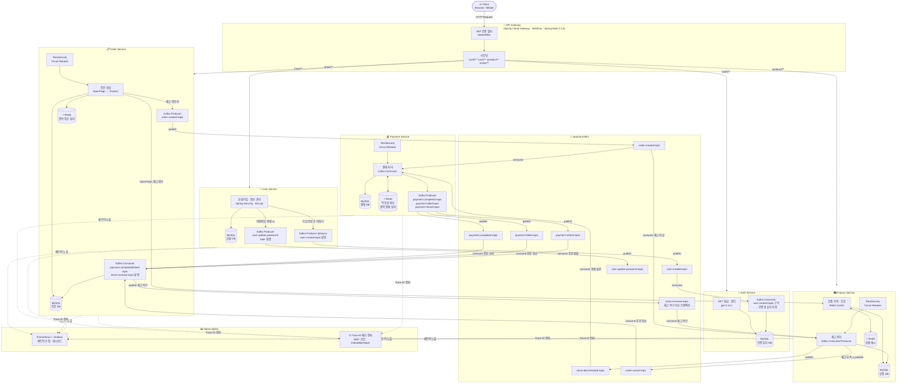

# 💳 CorePay — MSA 기반 결제 시스템

> **Java 21 · Spring Boot 4 · Kafka · Redis · MySQL · Docker**
> 실무 수준의 마이크로서비스 아키텍처를 직접 설계하고 구현한 백엔드 포트폴리오 프로젝트입니다.

---

## 📌 프로젝트 개요

CorePay는 MSA(Microservices Architecture) 패턴을 적용한 결제 시스템입니다.
사용자 인증, 상품 관리, 주문, 결제 등 실제 커머스 도메인을 독립된 서비스로 분리하여 구성하였으며,
서비스 간 통신은 **Apache Kafka** 이벤트 스트리밍과 **OpenFeign** 동기 호출을 혼용합니다.

| 항목 | 내용 |
|---|---|
| 언어 | Java 21 (Virtual Threads 지원) |
| 프레임워크 | Spring Boot 4.0.3 / Spring Cloud 2025.1.1 |
| 메시지 브로커 | Apache Kafka |
| 캐시 | Redis |
| DB | MySQL (Flyway 마이그레이션 관리) |
| 모니터링 | Spring Actuator + Micrometer + Prometheus / Grafana |
| 공통 라이브러리 | corepay-common (내부 Maven 배포) |
| 회복 탄력성 | Resilience4j (Circuit Breaker) |

---

## 🏗️ 시스템 아키텍처



---

## 📦 서비스 목록

### 🔐 Auth Service
> **역할**: JWT 액세스 토큰 발급 및 갱신, API Gateway에서의 토큰 검증 지원

- Spring Cloud Gateway (WebFlux 기반) 위에서 동작
- JWT 서명/검증 (`jjwt 0.12.x`)
- 모든 서비스의 인증 진입점 역할 수행
- **Kafka Consumer**: `user-created-topic` 구독 → 회원가입 시 User Service에서 발행한 이벤트를 수신하여 인증용 사용자 데이터 자체 저장 (이후 로그인 시 자체 보유 데이터로 JWT 발급)

🔗 **[corepay_auth 저장소 바로가기](https://github.com/jihoon-68/corepay_auth)**

---

### 👤 User Service
> **역할**: 회원 가입, 회원 정보 관리, Spring Security 기반 인증 처리

- Spring Security + JWT 적용 (서비스 내 자체 인증 계층 포함)
- **Kafka Producer** (`@Async` 비동기): 회원가입 완료 시 `user-created-topic` 발행 → Auth Service로 인증 데이터 전파 (응답 지연 없이 즉시 가입 응답 반환)
- **Kafka Producer**: 비밀번호 변경 시 `user-update-password-topic` 발행
- Flyway로 DB 스키마 버전 관리

🔗 **[corepay_user 저장소 바로가기](https://github.com/jihoon-68/corepay_user)**

---

### 🛍️ Product Service
> **역할**: 상품 등록/조회/재고 관리, Redis 캐싱으로 조회 성능 최적화

- Redis Cache로 상품 목록/상세 캐싱
- Kafka Consumer/Producer: 재고 차감·복원 이벤트 처리
- Resilience4j Circuit Breaker 적용
- Prometheus 메트릭 노출 (재고 변동 모니터링)

🔗 **[corepay_product 저장소 바로가기](https://github.com/jihoon-68/corepay_product)**

---

### 📋 Order Service
> **역할**: 주문 생성 및 상태 관리, 서비스 간 협력 오케스트레이션

- OpenFeign으로 Product Service 동기 호출 (재고 확인)
- Kafka Producer: 주문 생성 이벤트 → Payment Service로 전달
- Kafka Consumer: 결제 완료/실패 이벤트 수신 후 주문 상태 업데이트
- Resilience4j로 외부 서비스 장애 시 Fallback 처리
- Redis로 중복 주문 방지

🔗 **[corepay_order 저장소 바로가기](https://github.com/jihoon-68/corepay_order)**

---

### 💰 Payment Service
> **역할**: 결제 처리 및 트랜잭션 관리, 결제 이력 저장

- Kafka Consumer: 주문 이벤트 수신 후 결제 로직 실행
- Kafka Producer: 결제 성공/실패 이벤트 발행 → Order Service로 전달
- Redis로 멱등성(idempotency) 처리 (중복 결제 방지)
- Resilience4j Circuit Breaker로 외부 PG 장애 격리
- Prometheus + Grafana로 결제 성공률 및 처리 시간 모니터링

🔗 **[corepay_payment 저장소 바로가기](https://github.com/jihoon-68/corepay_payment)**

---

### 🚪 API Gateway
> **역할**: 단일 진입점(Single Entry Point), JWT 인증 필터, 서비스 라우팅

- Spring Cloud Gateway (Reactive / WebFlux 기반)
- 요청 수신 → JWT 토큰 검증 → 각 마이크로서비스로 라우팅
- Spring Boot 3.3.5 (Gateway 전용 안정화 버전 사용)

🔗 **[corepay_api_geteway 저장소 바로가기](https://github.com/jihoon-68/corepay_api_geteway)**

---

## 🔁 주요 흐름 1: 회원가입 → 인증 데이터 동기화

```
1. 클라이언트 → API Gateway → User Service (회원가입 요청)
2. User Service → MySQL (회원 정보 저장: id, email, password(BCrypt), role)
3. User Service → 클라이언트 (즉시 가입 응답 반환)
4. User Service → Kafka [user-created-topic] @Async 비동기 발행
        payload: { id, email, password, role }
5. Auth Service → Kafka [user-created-topic] 수신
        → 인증용 사용자 데이터 자체 저장
6. 이후 로그인 시: Auth Service가 자체 보유 데이터로 JWT 발급
```

> 💡 **설계 포인트**: `@Async`로 비동기 처리하기 때문에 Kafka 발행 완료를 기다리지 않고 사용자에게 즉시 가입 응답을 반환합니다. User ↔ Auth 서비스 간 결합도를 낮추고, 회원가입 응답 지연을 방지합니다.

---

## 🔁 주요 흐름 2: 주문 → 결제 이벤트 플로우

```
1. 클라이언트 → API Gateway (JWT 검증)
2. API Gateway → Order Service (주문 생성 요청)
3. Order Service → Product Service (OpenFeign: 재고 확인)
4. Order Service → Kafka (주문 생성 이벤트 발행)
5. Payment Service → Kafka (이벤트 소비 → 결제 처리)
6. Payment Service → Kafka (결제 결과 이벤트 발행)
7. Order Service → Kafka (결제 결과 소비 → 주문 상태 업데이트)
```

---

## 🛠️ 기술적 의사결정 포인트

| 기술 | 도입 이유 |
|---|---|
| Kafka (비동기 통신) | 서비스 간 강결합 방지, 장애 격리, 재처리 용이 |
| @Async + Kafka (회원가입) | 응답 지연 없이 인증 데이터 전파, User ↔ Auth 서비스 분리 유지 |
| Redis Cache | 상품 조회 응답 속도 개선, 중복 요청 방지 |
| Resilience4j | 외부 서비스 장애 시 Cascade Failure 방지 |
| Flyway | DB 스키마 변경 이력 추적 및 환경 간 일관성 확보 |
| Virtual Threads (Java 21) | I/O 바운드 처리 성능 향상, 스레드 비용 절감 |
| corepay-common | 중복 코드 제거, 서비스 간 공통 로직 통일 |
| Prometheus + Grafana | 실시간 메트릭 수집 및 대시보드 시각화 |
